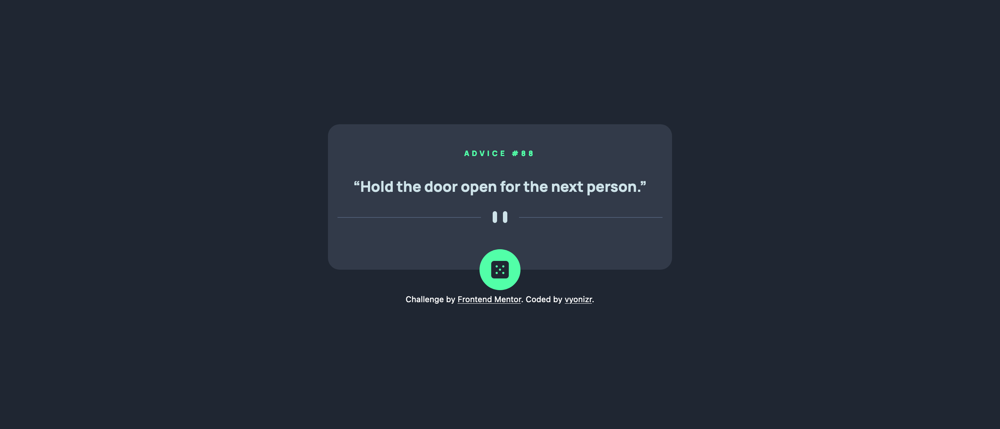

# Frontend Mentor - Advice generator app solution

This is a solution to the [Advice generator app challenge on Frontend Mentor](https://www.frontendmentor.io/challenges/advice-generator-app-QdUG-13db). Frontend Mentor challenges help you improve your coding skills by building realistic projects.

## Table of contents

- [Frontend Mentor - Advice generator app solution](#frontend-mentor---advice-generator-app-solution)
  - [Table of contents](#table-of-contents)
  - [Overview](#overview)
    - [The challenge](#the-challenge)
    - [Screenshot](#screenshot)
    - [Links](#links)
  - [My process](#my-process)
    - [Built with](#built-with)
    - [What I learned](#what-i-learned)
    - [Useful resources](#useful-resources)
  - [Author](#author)

## Overview

### The challenge

Users should be able to:

- View the optimal layout for the app depending on their device's screen size
- See hover states for all interactive elements on the page
- Generate a new piece of advice by clicking the dice icon

### Screenshot



### Links

- [Solution URL](https://github.com/vyonizr/fm-advice-generator-app)
- [Live Site URL](https://fm-advice.vyonizr.com/)

## My process

### Built with

- [Astro](https://astro.build/)
- [React](https://react.dev/)
- [Tailwind CSS](https://tailwindcss.com/)

### What I learned

In Astro, we need to include a directive called `client:load` to enable the use of React's `useEffect` hook. This is because Astro renders static HTML pages by default. To make a component interactive, we must specify that it should be hydrated.

```astro
<MyReactComponent client:load />
```

### Useful resources

- [Astro islands](https://docs.astro.build/en/concepts/islands/) - This helped me understand Islands architecture in Astro.

## Author

- [Website](https://vyonizr.com/)
- Frontend Mentor - [@vyonizr](https://www.frontendmentor.io/profile/vyonizr)
